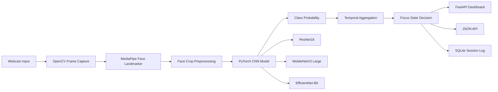
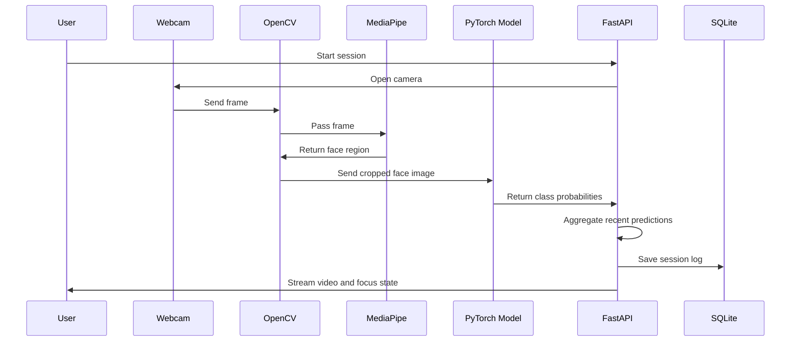
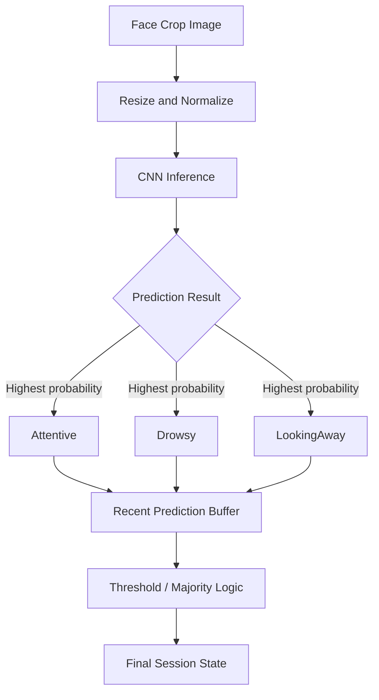
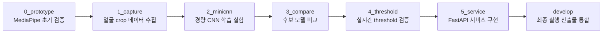
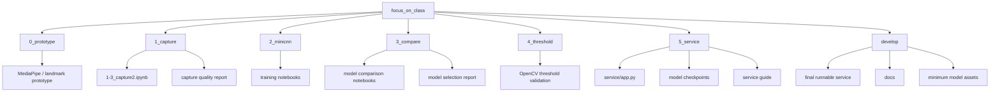
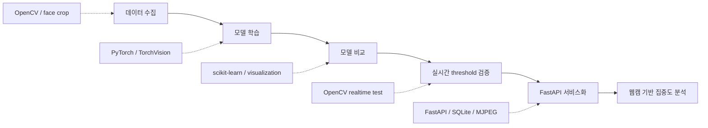

# focus_on_class 구조도 및 흐름도

## 1. 전체 시스템 구조도



## 2. 실시간 추론 흐름도



## 3. 모델 분류 흐름도



## 4. 개발 단계 흐름도



## 5. 브랜치별 산출물 구조도



## 6. 최종 실행 파일 구조

```text
focus_on_class
├─ README.md
├─ PROJECT_STRUCTURE_FLOW.md
├─ worktrees/
│  ├─ 0_prototype/
│  ├─ 1_capture/
│  ├─ 2_minicnn/
│  ├─ 3_compare/
│  ├─ 4_threshold/
│  ├─ 5_service/
│  │  ├─ service/
│  │  │  ├─ app.py
│  │  │  └─ GUIDE.md
│  │  ├─ models/
│  │  └─ mp_model/
│  └─ develop/
│     ├─ service/
│     │  └─ app.py
│     ├─ models/
│     │  ├─ resnet18_best.pt
│     │  ├─ mobilenet_v3_large_best.pt
│     │  └─ efficientnet_b0_best.pt
│     ├─ mp_model/
│     │  └─ face_landmarker.task
│     ├─ docs/
│     ├─ pyproject.toml
│     └─ uv.lock
└─ docs/
```

## 7. 포트폴리오용 요약 흐름


